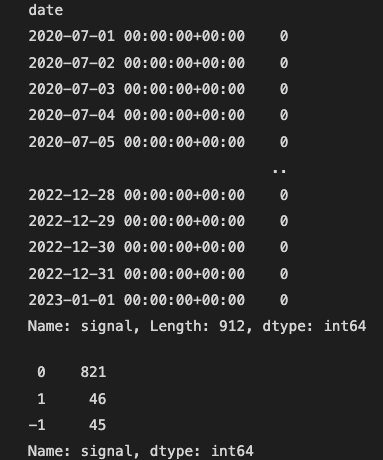
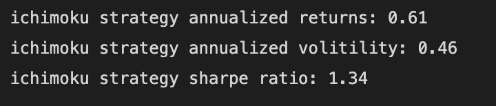
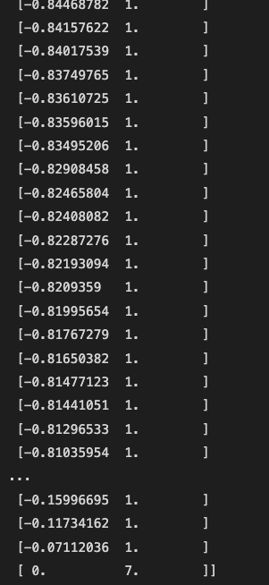

# Project-2---Algo-Trading-ML-Bot
## Algorithmic and Machine Learning Trading Bot

### Presentation Deck: https://docs.google.com/presentation/d/1CDhO2KZgJhaKbrxrh_fUmVAF2Ntfik1SgVeoMUuZgQs/edit?usp=sharing

Instructions:
You have the following ideas for your project:
* Compare two or more machine learning models for solving a predictive task.
* Use natural language processing (NLP) to draw insight from written or spoken language.
* Deploy a machine learning model in Amazon SageMaker as an API.
* Deploy a robo advisor that’s powered by Amazon Lex.
* Use machine learning to build a sophisticated algorithmic trading bot.

[](https://www.python.org/)
[](<LINK>)
[](<LINK>)

## Overview:

For this project Marc, Jerami and I(Anthony) chose to make an Algo trading bot that is optimized using a Deep Learnign Neural Network to answer a fundamental question:
Using the same data parameters, Is it better to use a single indicator or many indicators for a trading bot and will Deep Learning have an effect on the outcome? What about including Sentiment analysis as an indicator?
To answer these questions we put together the following plan:
* Choose our single indicator candidate and our multiple indicator candidates and build out functions to facilitate feeding any data to make our training and testing data sets.
* Make a Deep Learning Neural Network model, as a function, to feed our preprocessed, trained and tested data sets in to.
* Get Sentiment analysis from tweets on twitter to see if there is any correlation with sentiment and market swings.
* Finally we will put all of this together into a trading bot to trade our predicted signals from the Deep Learning models that are trained on our indicators.

## Our proccesses and Data cleaning:
Marc was in charge of Sentiment analysis.

Anthony was in charge of the multiple indicators and Deep Neural model

Jerami was in charge of the single indicator and order placement function

### Vader Sentiment Analysis
-----
For Marc's section of the project, He decided to create a Sentiment analysis of Tweets referencing Bitcoin during the period of February 2021 to August 2021. For this segment, he decided to use the Vader library to perform sentiment analysis on a set of tweets about the hashtag #BTC.

### Prerequisites
-----
Before you begin, make sure that you have the following packages installed:

>`Pandas`           https://pandas.pydata.org/

>`nltk`             https://www.nltk.org

>`hvPlot`           https://hvplot.holoviz.org

>`Numpy`            https://numpy.org/

>`pathlib`          https://pathlib.readthedocs.io/en/pep428/

>`alpaca_trade_api` https://alpaca.markets/docs/

>`finta`            https://github.com/peerchemist/finta/blob/master/finta/finta.py

>`json`             https://www.json.org/json-en.html

>`matplotlib`       https://matplotlib.org

>`Scikit-learn`     https://scikit-learn.org/stable/

>`Tensorflow`       https://www.tensorflow.org/

The following dependencies are required for sklearn.

>`classification_report` https://scikit-learn.org/stable/

The following dependencies are required for alpaca.

>`CryptoHistoricalDataClient`   https://alpaca.markets/docs/

>`CryptoBarsRequest` https://alpaca.markets/docs/

>`TimeFrame`        https://alpaca.markets/docs/
The following dependencies are required for tensorflow.

>`Dense`            https://www.tensorflow.org/

>`Sequential`       https://www.tensorflow.org/

>`train_test_split` https://www.tensorflow.org/
The following dependencies are required for nltk.

>`stopwords`        https://www.nltk.org

>`*`                https://www.nltk.org

>`SentimentIntensityAnalyzer`   https://www.nltk.org


### Running the Analysis
-----
1. Clone this repository to your local machine
2. Open the vader_sentiment_analysis.ipynb Jupyter Notebook
3. Run each cell in the notebook to perform the sentiment analysis
4. The final result of the analysis will be saved to a CSV file and visualized in a histogram plot


### Data
-----
The data used for this analysis is a set of tweets about the hashtag #BTC. The tweets were collected using the Twitter API and pre-processed to remove irrelevant information.

Here are some of Marc's data cleaning efforts:

* Import Libraries

```
# Importing all of the libraries

import numpy as np
import pandas as pd
import os
from tqdm import tqdm

#For Preprocessing & Vader Sentiment Analysis
import re    # RegEx for removing non-letter characters
import nltk  # natural language processing
nltk.download("stopwords")
from nltk.corpus import stopwords
from nltk.stem.porter import *
from nltk.sentiment.vader import SentimentIntensityAnalyzer
nltk.download('vader_lexicon')

# import hvplot for visualizations

from datetime import date
import hvplot.pandas
```


* Loading the tweet data set:
```
df0 = pd.read_csv('cleaned_tweets.csv', index_col='date', parse_dates=True, infer_datetime_format=True)
df0
```


* Tokenizing the tweets by breaking them down into separate words:
```
def tweet_to_words(tweet):
    ''' Convert tweet text into a sequence of words '''
     
    # Check if the input is a string
    if not isinstance(tweet, str):
        raise TypeError("Input is not a string")
    
    # convert to lowercase
    text = tweet.lower() 
    # remove non letters
    text = re.sub(r"[^a-zA-Z0-9]", " ", text)
    # tokenize
    words = text.split()
    # remove stopwords
    words = [w for w in words if w not in stopwords.words("english")]
    # apply stemming
    words = [PorterStemmer().stem(w) for w in words]
    # return list
    return words
```


* Cleaning the text by using the function from above:
```
cleantext=[]
for item in tqdm(df['text']):
    words=tweet_to_words(item)
    cleantext+=[words]
df['cleantext']=cleantext
df
```
* Concatenating items in a list to create:
```
def unlist(list):
    words=''
    for item in list:
        words+=item+' '
    return words
```

### Sentiment Analysis with Vader
-----
The Vader library is used to perform sentiment analysis on the text data. The library uses a lexicon of words and emoticons to determine the sentiment of a given text. The resulting sentiment scores are reported as negative, neutral, positive, and compound scores, where the compound score is a normalized score between -1 and 1 that indicates the overall sentiment of the text.

* Making a function to compute Vader Sentiment analysis to calculate the polarity of the tweets:
```
def compute_vader_scores(df, label):
    sid = SentimentIntensityAnalyzer()
    df["vader_neg"] = df[label].apply(lambda x: sid.polarity_scores(unlist(x))["neg"])
    df["vader_neu"] = df[label].apply(lambda x: sid.polarity_scores(unlist(x))["neu"])
    df["vader_pos"] = df[label].apply(lambda x: sid.polarity_scores(unlist(x))["pos"])
    df["vader_comp"] = df[label].apply(lambda x: sid.polarity_scores(unlist(x))["compound"])
    df['cleantext2'] = df[label].apply(lambda x: unlist(x))
    return df
```


* Added Vader score to a new dataframe and reset index:
```
df2 = compute_vader_scores(df, 'cleantext')
df2 = df2.reset_index()
df2
```
* Doing some additional cleaning:
```
# convert the 'date_str' column to datetime, replacing invalid strings with NaT
df2['date2'] = pd.to_datetime(df2['date'], errors='coerce')

# drop the rows with NaT in the 'date' column
df2.dropna(subset=['date2'], inplace=True)

# reset the index
df2.reset_index(drop=True, inplace=True)
```
* Grouping the data by date and aggregating the scores by their mean:
```
agg_df = df2.groupby(by=df2['date2'].dt.date).agg({'vader_comp': 'mean'})

agg_df
```


* Saving the Vader comp to csv and re-importing the Vader comp as a DataFrame:
```
# save the Vader Comp to csv 
agg_df.to_csv("bitcoin-tweets-vader-sentiment-final.csv", index=True)
```


```
# re-import the Vader Comp for visualization as plot_df
plot_df = pd.read_csv('./Resources/bitcoin-tweets-vader-sentiment-final.csv')

# display the new plot_df dataframe
plot_df
```

* Converting the DateTime format in the df:
```
# convert plot_df to a datetime format
plot_df['date2'] = pd.to_datetime(plot_df['date2'], format='%Y-%m-%d')

# display plot_df to make sure it looks okay
plot_df['date2']
```

### Visualizing the Results
-----
The results of the sentiment analysis are visualized using the hvplot library. The histogram plot shows the distribution of the Vader compound scores for each date. This provides an overall picture of the sentiment towards the hashtag #BTC on different dates.

* Dropped the hours from the DateTime and made a bar plot of the Vader comp scores:
```
# drop the hours from the datetime format
plot_df['date2'] = pd.to_datetime(plot_df['date2']).dt.strftime('%Y-%m-%d')

# hvplot bar chart of Vader Comp
plot_df.hvplot.bar(
    y='vader_comp', 
    x='date2', 
    title='Vader Sentiment Analysis for #BTC Tweets', 
    ylabel='Vader Composition Score', 
    xlabel='Tweet Dates', 
    height=500, 
    width=1500, 
    legend='top_left', 
    rot=45,
    )
```


## Multi-Indicator Technical Analysis and Deep Learning Model
----
For this part of the Project, Anthony chose to use a mulit-indicator approach and experiment with a Deep Neural model to see what affects it has on the signals.

### Indicators 
----
For the indicators used for this experiment Anthony chose the ADX, SMA, RSI, MACD, MACD Signal, MACD Histogram, and Squeeze Momentum Indicator. He made a function to pass in any ohlcv with any timeframe to streamline the process.

* Defined a function that calls a set of functions to be created on any df:
```
def indicators(df, sma, rsi, macd_fast, macd_slow, macd_signal, adx, squeeze):

    df['SMA_20'] = TA.SMA(df, sma)
    df['RSI_14'] = TA.RSI(df, rsi)
    MACD = TA.MACD(df, macd_fast,macd_slow,macd_signal,'close', adjust=True)
    df['MACD'] = MACD['MACD']
    df['MACD_Signal'] = MACD['SIGNAL']
    df['MACD_Histogram'] = df['MACD'] - df['MACD_Signal']
    df['Squeeze'] = TA.SQZMI(df, squeeze)
    df['ADX'] = TA.ADX(df,adx)
    percent = df['close'] * (5/100)
    df['stop_loss_short'] = df['close'] + percent
    df['stop_loss_long'] = df['close'] - percent
    return df
```


* Calling the indicator functions with different timeframes:

```
# Reviewing the indicator function

indicator_daily_df = indicators(daily_ohlcv,20,7,8,13,5,14,20)
indicator_signals_4hr_df = indicators(four_hr_ohlcv,20,7,8,13,5,14,20)
indicator_hourly_df = indicators(ohlcv_df,20,7,5,8,3,14,20)
indicator_twelve_hr_df = indicators(twelve_hr_ohlcv,20,7,5,8,3,14,20)
indicator_weekly_df = indicators(weekly_ohlcv,20,7,8,13,5,14,20)
indicator_twelve_hr_df
```


* Created a signal based off the indicators:
```
def long_short_signal(df):
    df['signal'] = 0.0
    df['shares_held'] = 0.0
    df['order_size'] = 100
    # Long signal
    df.loc[(df['RSI_14'] < 35) & (df['ADX'] < 35) & (df['MACD_Histogram'] < -50) & (df['MACD'] < df['MACD_Signal']), 'signal'] = 1
     
    # df['shares_purchased'] = False
    # Short signal
    df.loc[(df['RSI_14'] > 78) & (df['RSI_14'] / df['ADX'] >= 2.5) & (df['MACD_Histogram'] > 100) & (df['MACD'] > df['MACD_Signal']), 'signal'] = -1
    # Exit trade signal
    return df
```


* Calling the long/short function to print the df with signals:
```
# Calling the buy/sell algo
Multi_indicator_trade_bot = long_short_signal(indicator_daily_df)

#indicator_signals_4hr_df['signal'] = indicator_signals_4hr_df['signal'].shift()
Multi_indicator_trade_bot

```

* Made a plot to show cumulative returns:
```
Multi_indicator_trade_bot['actual returns'] = Multi_indicator_trade_bot['close'].pct_change().dropna()
Multi_indicator_trade_bot['strategy returns'] = Multi_indicator_trade_bot['actual returns'] * Multi_indicator_trade_bot['signal'].shift()
Strategy_returns = (1 + Multi_indicator_trade_bot[['strategy returns']]).cumprod().hvplot(
    height=500,
    width=1500
)
Strategy_returns
```

* Reviewed the value counts for the signals:
```
Multi_indicator_trade_bot['signal'].value_counts()
```


### Data Cleaning
------
Here is a look into the data cleaning and preprocessing efforts fo rthe indicators and Deepe Neural model.

* Pulled ohlcv data from alpaca api CryptoBarsRequest:
```
# Instantiating the crypto client
client = CryptoHistoricalDataClient()
# Setting a start date and end date
#start_date = pd.Timestamp('2020-01-01', tz='America/New_York').isoformat()
#end_date = pd.Timestamp('2023-01-01', tz='AMerica/New_York').isoformat()
# Setting the tickers
#ticker = ['BTC/USD']

# Setting timeframe to '4Hour' for Alpaca API
#timeframe = '4Hour'

# Getting current ohlcv for BTC/USD
request_params = CryptoBarsRequest(
    symbol_or_symbols=['BTC/USD'],
    timeframe=TimeFrame.Hour,
    start='2020-07-01 00:00:00',
    end='2023-01-01 00:00:00'
)

# Retreiving the $ hourly bars for BTC/USD
btc_bars_48months = client.get_crypto_bars(request_params)

# Converting to a DataFrame
btc_bars_48months.df
```

* Dropped unnecessary columns, reset index, renamed columns, and made into a .csv file:
```
# Converting json to a dataframe
btc_bars_48months_df = btc_bars_48months.df
# Dropping columns
ohlcv_df  = btc_bars_48months_df.drop(columns=['trade_count','vwap'])
# Renaming the 'timestamp' column to the 'date' column and setting it as an index
ohlcv_df = ohlcv_df.reset_index()
ohlcv_df['date'] = ohlcv_df['timestamp']
ohlcv_df = ohlcv_df.drop(columns=['timestamp','symbol'])
ohlcv_df.set_index('date', drop=True, inplace=True)
# Making the df into a csv file
ohlcv_df.to_csv('Resources/ohlcv_BTC.csv')
```

* Read the csv back into a df a resampled the data into multiple time formats:
```
# Reading in the csv to a df
ohlcv_df = pd.read_csv(
    Path('./Resources/ohlcv_BTC.csv'),
    index_col='date',
    infer_datetime_format=True,
    parse_dates=True
)

# Resampling the df to be 4hr candles
four_hr_ohlcv = resample_calendar(ohlcv_df, '4h')
four_hr_ohlcv.dropna(inplace=True)
daily_ohlcv = resample_calendar(ohlcv_df, '1d')
daily_ohlcv.dropna(inplace=True)
twelve_hr_ohlcv = resample_calendar(ohlcv_df, '12h')
twelve_hr_ohlcv.dropna(inplace=True)
weekly_ohlcv = resample_calendar(ohlcv_df, '1w')
weekly_ohlcv.dropna(inplace=True)
twelve_hr_ohlcv
```

* Made custom buy/sell signals for the indicators to see if there couldd be correlation between the indicators and primo entries and exits:
```
# Making all of the signals 0 to put custom signals to train data
Multi_indicator_trade_bot['signal'] = 0
# Making custom buy signals
Multi_indicator_trade_bot.loc[['2020-09-05','2020-09-23','2020-11-27','2020-12-11','2021-01-21','2021-01-12','2021-01-27','2021-02-28','2021-03-25','2021-04-03','2021-04-07','2021-04-25','2021-05-04','2021-05-23',
                                '2021-05-29','2021-06-07','2021-06-21','2021-06-25','2021-07-01','2021-07-20','2021-08-03','2021-08-18','2021-09-21','2021-10-27','2021-11-26','2021-12-17','2022-01-22','2022-02-21',
                                '2022-03-13','2022-04-11','2022-04-30','2022-05-12','2022-05-27','2022-06-03','2022-06-18','2022-07-02','2022-07-12','2022-07-26','2022-08-04','2022-08-19','2022-09-06',
                                '2022-09-21','2022-10-20','2022-11-09','2022-11-21','2022-12-19'],['signal']] = 1
# Making cutom sell signals
Multi_indicator_trade_bot.loc[['2020-09-19','2020-11-24','2020-11-30','2021-01-08','2021-01-14','2021-01-22','2021-02-21','2021-03-13','2021-04-02','2021-04-05','2021-04-13','2021-04-30','2021-05-08','2021-05-26','2021-06-03',
                                '2021-06-14','2021-06-24','2021-06-29','2021-07-04','2021-07-30','2021-08-13','2021-09-06','2021-10-20','2021-11-08','2021-11-29','2021-12-23','2022-02-09','2022-03-01','2022-03-29',
                                '2022-04-19','2022-05-04','2022-05-15','2022-05-30','2022-06-06','2022-06-25','2022-07-07','2022-07-19','2022-07-28','2022-08-13','2022-08-25','2022-09-12','2022-10-04',
                                '2022-11-05','2022-11-10','2022-12-14'],['signal']] = -1


Multi_indicator_trade_bot['signal'].value_counts()
```

* Plotted returns for the custom signals:
```
Multi_indicator_trade_bot['actual returns'] = Multi_indicator_trade_bot['close'].pct_change().dropna()
Multi_indicator_trade_bot['strategy returns'] = Multi_indicator_trade_bot['actual returns'] * Multi_indicator_trade_bot['signal'].shift()
Strategy_returns = (1 + Multi_indicator_trade_bot[['strategy returns']]).cumprod().hvplot(
    height=500,
    width=1500
)
Strategy_returns
```


* Encoded the Squeeze indicator:
```
# Getting a list of categorical values
categorical_variables = list(Multi_indicator_trade_bot.dtypes[Multi_indicator_trade_bot.dtypes == 'bool'].index)
# instantiating my encoder
enc  = OneHotEncoder(sparse=False)
# Encoding the categorical values
encoded_data = enc.fit_transform(Multi_indicator_trade_bot[categorical_variables])
# Creating a Dataframe for the CAtegorical values
encoded_df = pd.DataFrame(
    encoded_data,
    index=Multi_indicator_trade_bot.index,
    columns=enc.get_feature_names(categorical_variables)
)
# Reviewing the data frame
encoded_df.head()
```


* Concated the numerical values with the encoded data:
```
# Creating a new DataFRame that contains the encoded variables and the numerical variables combined
numerical_variables = Multi_indicator_trade_bot.drop(columns=categorical_variables)
# Concatting the two DataFrames
enc_Multi_indicator_df = pd .concat(
    [
        numerical_variables,
        encoded_df
    ],
    axis=1
)
# Reviewing the new df
enc_Multi_indicator_df
```


* Made the training and testing data:
```
# Making the testing and training data sets
X = enc_Multi_indicator_df[['open', 'high', 'low', 'close', 'volume', 'SMA_20', 'RSI_14', 'MACD',
       'MACD_Signal', 'MACD_Histogram', 'Squeeze_False', 'Squeeze_True', 'ADX', 'stop_loss_short',
       'stop_loss_long']].shift().dropna().copy()

display(X)

y = enc_Multi_indicator_df['signal'].copy()

display(y)
y.value_counts()
```




### Deep Neural model
-----
For this segment Anthony made a function to train, test, scale and put the data into a deep neural network. As well as evaluate and return the trained model, X_test_scaled, and y_test:
* Made a function for feeding X and y data:
```
# Making the testing and training data sets
def train_test_data(X,y):
    # Settign training and testing parameters
    training_begin = X.index.min()
    training_end = X.index.min() + DateOffset(months=24)
    X_train = X.loc[training_begin:training_end]
    y_train = y.loc[training_begin:training_end]
    X_test = X.loc[training_end:]
    y_test = y.loc[training_end:]
    # Scaling the training and testing data
    scaler = StandardScaler()
    X_scaler = scaler.fit(X_train)
    X_train_scaled = X_scaler.transform(X_train)
    X_test_scaled = X_scaler.transform(X_test)
    # Initiating Deep Neural Network
    number_input_features = len(X_train.iloc[0])
    number_output_neurons = 1
    # Defining number of hidden nodes for first layer
    hidden_nodes_layer1 = np.ceil(np.sqrt(number_input_features * number_output_neurons))
    # Defining the number of hidden nodes in layer 2
    hidden_nodes_layer2 = np.ceil(np.sqrt(hidden_nodes_layer1 * number_output_neurons))
    # Creating the Sequential model instance
    nn=Sequential()
    # Adding the first layer
    nn.add(
        Dense(
            units=hidden_nodes_layer1,
            activation='relu',
            input_dim=number_input_features
        )
    )
    # Adding second layer
    nn.add(
        Dense(
            units=hidden_nodes_layer2,
            activation='relu'
        )
    )
    # Adding the output layer
    nn.add(
        Dense(
            units=1,
            activation='softmax'
        )
    )
    # Reviewing the Sequential model
    print(nn.summary())
    # Compiling the Sequential model
    nn.compile(
        loss='binary_crossentropy',
        optimizer='adam',
        metrics=['accuracy']
    )
    # Fitting the model with the epochs nad training data
    nn.model=nn.fit(X_train_scaled, y_train, epochs=100, verbose=2)
    # Evaluating the Neural Network
    nn.evaluate(X_test_scaled,y_test)

    
    return nn, X_test_scaled, y_test
```

* Returned the trained model, X_test_scaled, and y_test by calling the function:
```
trained_model, X_test_scaled, y_test = train_test_data(X, y)
```


* Returned predictions:
```
predictions = trained_model.predict(X_test_scaled)

#for i in range(len(predictions)):
    #if predictions[i] >= 0.5:
     #   predictions[i] = 1
    #else:
       # predictions[i] = -1

#unique, counts = np.unique(predictions, return_counts = True)
#print(np.asarray((unique, counts)).T)
predictions
```


## Single Indicator and exchange order placement function
------
For this segment of the project Jerami chose to use the Ichimoku Indicator to find entries and exits. Jerami also made an order placement function which places orders dependant on a buy or sell signal from the indicator.

## Processing data
------
Here is a look into the data cleaning and processing:
* Processed ohlcv dataframe to use with ichimoku indicator:
```
def process_data_ohlcv(df):

    ohlcv_df = df.drop(columns=['exchange','trade_count','vwap'])
    #ohlc_df = df.drop(columns=['volume'])
    ichimoku_df = TA.ICHIMOKU(ohlcv_df, tenkan_period= 20, kijun_period= 60, senkou_period= 120, chikou_period= 30)
    ichimoku_df = pd.concat([ichimoku_df, ohlcv_df['close']], axis=1)

    return ichimoku_df
```

* Defined another function to print buy and sell signals:
```
# Creating ichimoku indicator dataframe
ichimoku_df = process_data_ohlcv(btc_data)

# Trade signal logic on indicator
def get_signal(df):
    # Creating signal feature
    df['signal'] = 0

    # Creating entry signal when Tenkan is greater than Kijun and price is above the cloud
    # Creates exit signal when Tenkan is less than Kijun and price falls into cloud
    df["signal"] = np.where((df["TENKAN"] > df["KIJUN"]) &
                                (df["close"] > df["senkou_span_a"]), 1, 0)
    # Prints entry/exit signal
    df['entry/exit'] = df['signal'].diff()
    
    # Calculates returns of bitcoin and our strategy
    df['actual_returns'] = df['close'].pct_change()
    df["strategy_returns"] = df["actual_returns"] * df["signal"].shift() 

    actual_returns = df['actual_returns'].cumsum()
    
    
    return df
```


* Made our training and testing data:
```
# Creates signal dataframe
ichimoku_signal_df =  get_signal(ichimoku_df)

# Making the testing and training data sets
X = ichimoku_signal_df[['TENKAN', 'KIJUN', 'senkou_span_a', 'SENKOU', 'CHIKOU', 'close',
       'signal']].shift().dropna().copy()
print(X.tail())
y = ichimoku_signal_df['entry/exit'].copy()
print(y.tail())
y.value_counts()
```

* Used the function Anthony created to train and test ichimoku data in the Deep Neural model:
```
def train_test_data(X,y):
    # Settign training and testing parameters
    training_begin = X.index.min()
    training_end = X.index.min() + DateOffset(months=24)
    X_train = X.loc[training_begin:training_end]
    y_train = y.loc[training_begin:training_end]
    X_test = X.loc[training_end:]
    y_test = y.loc[training_end:]
    # Scaling the training and testing data
    scaler = StandardScaler()
    X_scaler = scaler.fit(X_train)
    X_train_scaled = X_scaler.transform(X_train)
    X_test_scaled = X_scaler.transform(X_test)
    # Initiating Deep Neural Network
    number_input_features = len(X_train.iloc[0])
    number_output_neurons = 1
    # Defining number of hidden nodes for first layer
    hidden_nodes_layer1 = np.ceil(np.sqrt(number_input_features * number_output_neurons))
    # Defining the number of hidden nodes in layer 2
    hidden_nodes_layer2 = np.ceil(np.sqrt(hidden_nodes_layer1 * number_output_neurons))
    # Creating the Sequential model instance
    nn=Sequential()
    # Adding the first layer
    nn.add(
        Dense(
            units=hidden_nodes_layer1,
            activation='relu',
            input_dim=number_input_features
        )
    )
    # Adding second layer
    nn.add(
        Dense(
            units=hidden_nodes_layer2,
            activation='relu'
        )
    )
    # Adding the output layer
    nn.add(
        Dense(
            units=1,
            activation='sigmoid'
        )
    )
    # Reviewing the Sequential model
    print(nn.summary())
    # Compiling the Sequential model
    nn.compile(
        loss='binary_crossentropy',
        optimizer='adam',
        metrics=['accuracy']
    )
    # Fitting the model with the epochs nad training data
    nn.model=nn.fit(X_train_scaled, y_train, epochs=100, verbose=2)

    return nn, X_test_scaled, y_test
```

* Made a function for creating an order in alpaca api:
```
# function to buy/sell btc through alpaca
def create_order(symbol, qty, side, order_type, time_in_force, api_key_id, api_secret_key):
    headers = {
        "Apca-Api-Key-Id": api_key_id,
        "Apca-Api-Secret-Key": api_secret_key,
        "Content-Type": "application/json"
    }

    data = {
        "symbol": symbol,
        "qty": qty,
        "side": side,
        "type": order_type,
        "time_in_force": time_in_force
    }

    url = "https://paper-api.alpaca.markets/v2/orders"
    response = requests.post(url, headers=headers, json=data)

    if response.status_code != 200:
        raise ValueError("Failed to create order: " + response.text)

    return response.json()
```
* Conditional statements to place order under specific circumstnaces:
```
if ichimoku_signal_df['entry/exit'].iloc[-1] == 1.0:
    create_order("BTC/USD", "1.0", "buy", "market", "gtc", api_key_id, api_secret_key)
elif ichimoku_signal_df['entry/exit'].iloc[-1] == -1.0:
    create_order("BTC/USD", "1.0", "sell", "market", "gtc", api_key_id, api_secret_key)
else:
    print('No Trades Today!')
```

* Made some extra calculations about the excellent returns generated by the ichi'smoked u' indicator:
```
# Strategy_returns_annual_volitility
strategy_returns_annual_volitility = ichimoku_signal_df[['strategy_returns']].std()*np.sqrt(365)

# Calculates key performance metrics of the fund
annualized_return = ichimoku_signal_df["strategy_returns"].mean() * 365
annualized_std = ichimoku_signal_df["strategy_returns"].std() * np.sqrt(365)
sharpe_ratio = round(annualized_return/annualized_std, 3)

# Displays metrics
print(f"ichimoku strategy annualized returns: {round(annualized_return,2)}")
print(f"ichimoku strategy annualized volitility: {round(annualized_std,2)}")
print(f"ichimoku strategy sharpe ratio: {sharpe_ratio}")
```

# Conclusion
------
Our final impressions of this project are as follows:

* The signal indicator approach had the best results out of the box, it was much simpler to use and provided great results. We were also able to apply the Ichimoku to ETH and at first it didn't work great but Jermai tweaked the settings and we saw immediate results. We saw very good signals and we saw excllent returns.


* Deep neural network model needs work to return the signals we are looking for. Right now the neural network is returning decimals and we need returns of 1,0,-1 for buy, sell, and hold signals. We tried resolving thios issue by changing the activation method in the output node from sigmoid to softmax and that had 'a' desired eefect but it only returned 1's. We also tried tanh but that returned decimals and numbers between 4 and -4 and that doesnt really help us.
```
unique, counts = np.unique(predictions, return_counts = True)
print(np.asarray((unique, counts)).T)
predictions
```



* The Vader sentiment analysis provided some very useful insight and it is definitely something we want to use as an indicator moving forward. We saw peaks when important things happened to the price and some pretty good correlation to price action.


## Next steps:
For next steps in this project we would like to do the following things:
* Fine tune the multi indicator approach.
* Fine tune the Ichimoku cloud.
* Include vader sentiment analysis as an indicator.
* Fix the isssues we have with the deep neural network model.
* Put it all together to make an all in one trading bot that works in bull and bear markets.


